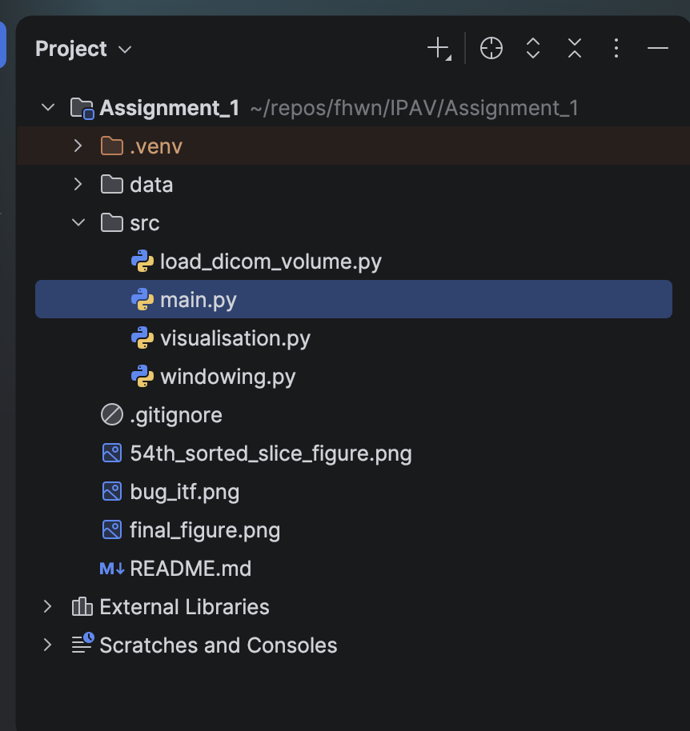
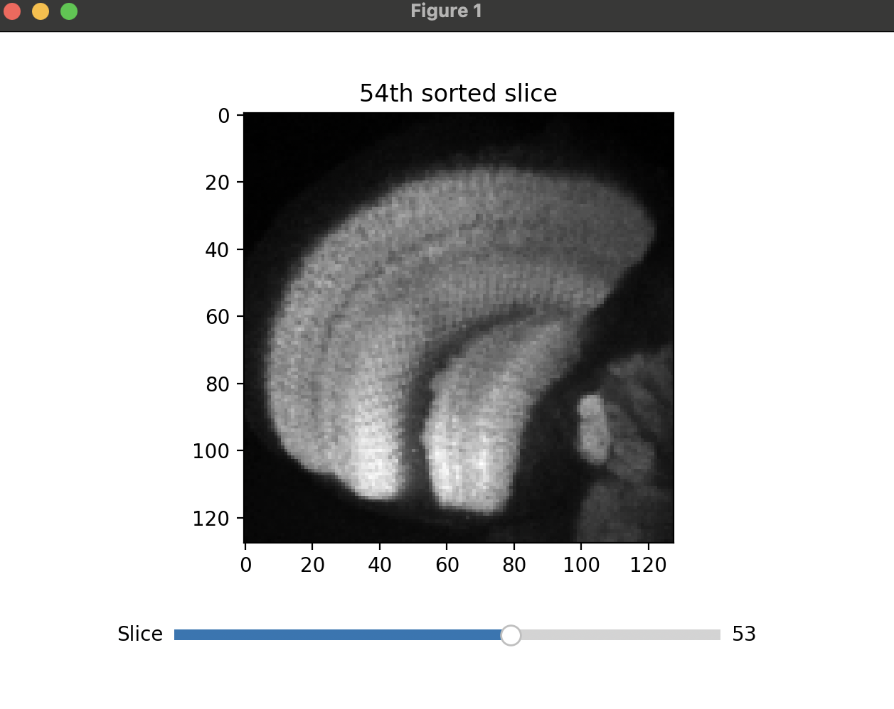
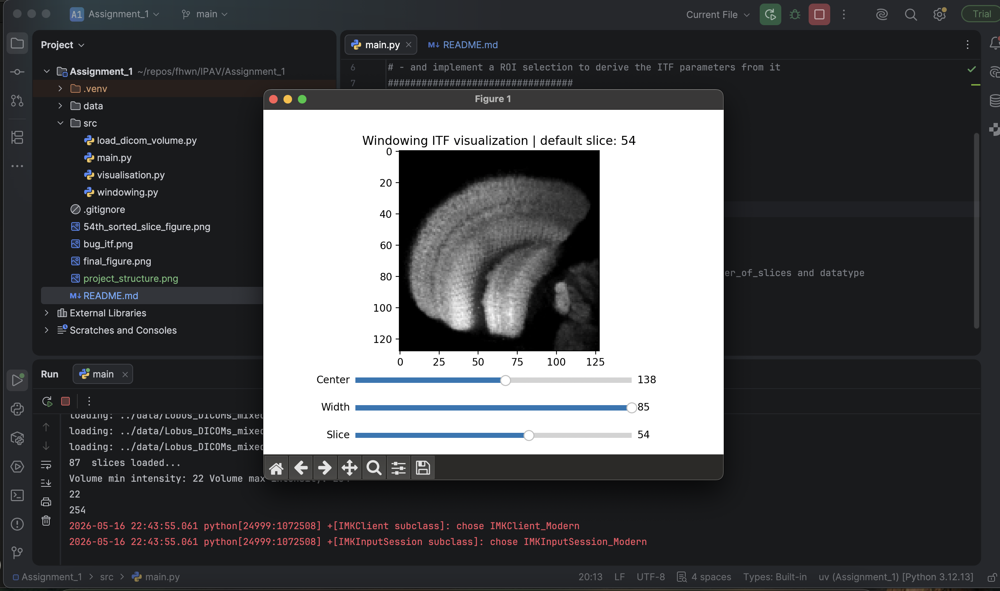
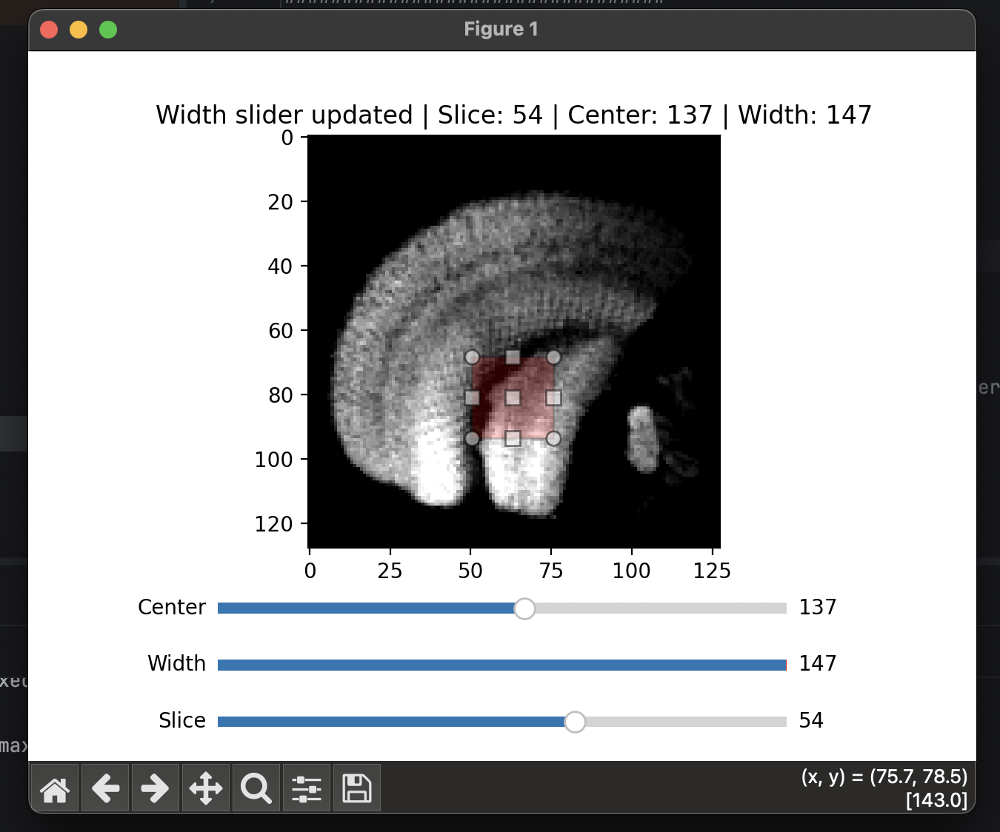
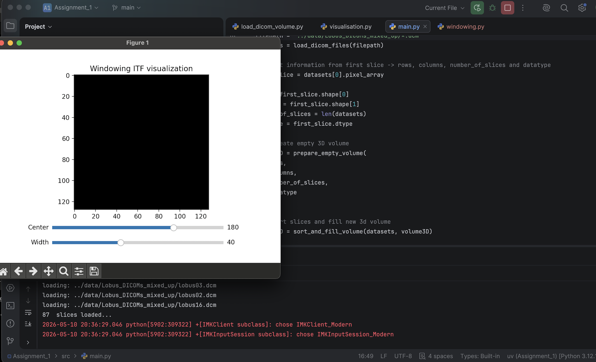

# assignments_ipav – Report Summary

**Project Structure**

I divided the assignment into 3 main blocks and created a separate module for each:

- load_dicom_volume.py – loading DICOM files, creating 3D volume, sorting slices
- visualisation.py     – displaying selected slice, slice slider
- windowing.py         – windowing ITF, center/width sliders, ROI selection
- main.py              – entry point, calls all helper functions

Each file contains the TODO section from the assignment that it covers, so it is clear which part of the assignment is solved where.

The project has a src/ folder for all Python files and a data/ folder for the DICOM files.

**Development Process**

Initially each module was a standalone script,  for example visualisation.py contained its own file paths and all setup logic. After the basic functionality worked, I refactored all modules into clean helper functions. Settings and parameters that were duplicated across files were converted into function parameters, so they are defined only once (for example in main.py) and passed between modules.

The entire development process is documented in the GitHub repository: https://github.com/MrsPomodoro/assignments_ipav, where all code changes are visible through detailed commits including descriptions of what was done at each step. Detailed explanations of the development process are also captured in the code comments from that time. The final submitted code contains only comments relevant to the final version of the code.

**load_dicom_volume.py**

First commit: I started from the given base code and extended it directly in the file. I first explored the loaded datasets by printing them to understand the DICOM structure and find the correct metadata tag for slice ordering. I discovered that InstanceNumber (tag 0x0020, 0x0013) contains the correct slice position. I then explored the shape and datatype of the first slice using .pixel_array, .shape and .dtype,  the same approach as shown in the lecture examples. Based on this I created prepare_empty_volume() and sort_and_fill_volume() which places each slice into its correct z-position in the 3D array using the Instance Number.

Second commit: I refactored the loading code into a helper function load_dicom_files() so it could be called with a filepath parameter instead of running directly at import.

Third commit: I cleaned up the file completely, removed all exploration print statements and standalone execution code, keeping only the three clean helper functions: load_dicom_files(), prepare_empty_volume() and sort_and_fill_volume(). All parameters like filepath, rows, columns and datatype are now passed in from main.py.

Final commit: Added the assignment TODO block at the top, updated comments and added the required "ensure homogenization" phrase to the sort_and_fill_volume comment.

**visualisation.py**

First commit: I created visualisation.py with a visualize_54th_slice() function that displays a selected slice using matplotlib imshow() with grayscale colormap.

Second commit: I added show_slice_slider() which creates a separate matplotlib figure with two axes — one for the image and one for the slice slider. The slider uses on_changed() callback with update_slice() function that updates the image data using set_data() when the slider value changes.

Third commit: I fixed the default slice_index and did small refactoring to make the function signatures consistent with how they are called from main.py.

Fourth commit: I joined the 54th slice visualization and the slider into one single figure instead of two separate ones.

Fifth commit: I joined visualisation.py and windowing.py into one figure — the slice slider from visualisation.py is now passed into windowing.py and all three sliders share the same figure.

Final commits: Cleaned up comments, renamed visualize_54th_slice to visualize_selected_slice since the function displays any slice, not just the 54th.

**windowing.py**

First commit: I created windowing_itf() function based on lecture exercise06. The function takes an intensity value range, center and width parameters and returns an ITF array. It calculates left and right window boundaries, clamps them to the valid range, and fills the window with linearly mapped intensity values using np.linspace(). I also created show_windowing() which displayed the first slice (index 0) with the ITF applied and added center and width sliders with update_windowing() callback and ROI selection using RectangleSelector.

Second commit:I fixed the default slice_index from 0 to 53 to show the 54th slice as required by the assignment.

Third commit: I joined windowing.py and visualisation.py into one single figure. The slice slider from visualisation.py is now imported into show_windowing() via show_slice_slider() and all three sliders share the same figure. The slice_slider return value from visualisation.py is used in update_windowing() to get the current slice index.

Fourth commit: Cleaned up comments and simplified the structure of the file.

Fifth commit: I noticed the figure title always showed "Center slider updated" regardless of which slider was changed. I fixed this by adding a changed_slider list variable and three small helper callbacks on_center(), on_width() and on_slice(). Each callback sets changed_slider[0] to the correct name before calling update_windowing().

Sixth commit: I found RuntimeWarning: overflow encountered in scalar add in the terminal log at roi_center = (roi_min + roi_max) // 2. This happened because DICOM pixel data is stored as uint8 and adding two large values exceeded 255. I fixed it by converting both values to int before the calculation.

Final commit: Final cleanup of all comments and documentation across all files.

**main.py**

First commit: main.py was created as a clean entry point that calls helper functions from other modules. It imports load_dicom_files(), prepare_empty_volume(), sort_and_fill_volume() from load_dicom_volume.py and show_54th_slice() from visualisation.py. It loads the datasets, extracts shape and datatype from the first slice, creates the empty 3D volume, fills it with sorted slices and calls show_54th_slice().

Second commit: I Added show_slice_slider() import and call after show_54th_slice().

Third commit: Then added show_windowing() import and call. At this point all three visualization functions were called separately from main.py.

Fourth commit: I Fixed slice_index = 53 and passed it explicitly as a parameter to show_54th_slice() and show_slice_slider().

Fifth commit: I Removed show_54th_slice() call from main.py since the 54th slice visualization was merged into show_slice_slider() directly in visualisation.py.

Sixth commit: Removed show_slice_slider() call and import from main.py since it was now called inside show_windowing() in windowing.py. main.py now only calls show_windowing(volume3D) for all visualization.

Seventh commit:  Fixed the filepath from '../data/...' to 'data/...' to match the correct relative path from the project root. Removed the standalone slice_index = 53 line since it is now set inside show_windowing(). Added print for volume min and max intensity.

**Final Tuning and Refactoring**

After everything was working and refactored, I went through the assignment requirements one more time and made these final fixes:

1. Title not updating correctly per slider: I noticed the figure title always showed "Center slider updated" regardless of which slider was changed. I fixed this by creating a changed_slider variable and three small helper callbacks (on_center, on_width, on_slice), each setting the variable before calling update_windowing.

2. Overflow fix: In the terminal log I found RuntimeWarning: overflow encountered in scalar add at roi_center = (roi_min + roi_max) // 2. This happened because DICOM pixel data is stored as uint8 and adding two large values caused overflow. I fixed it by converting to int before the calculation:

3. Missing "ensure homogenization" comment: The assignment explicitly required the comment before sort_and_fill_volume to contain the words "ensure homogenization". I added this to the function comment in load_dicom_volume.py.

Final solution:

**Bug Fixing - what I wasn't able to fix by myself and what I tried**

During development I encountered a bug with the windowing ITF not displaying correctly. The image was showing as a black 
square instead of the loaded slice. I used an AI assistant to help identify the issue because I wasn't able to figure it 
out by myself after several attempts. As an attachment you can see my conversation.

Before using the AI assistant I tried to fix the issue myself. First I added debug prints for volume3D.min() and volume3D.max() 
to check the actual intensity range of the data. Second I tried manually adjusting the hardcoded centerand width values slightly 
in the code to see if the image would change, but the effect was minimal and I did not yet understand that the hardcoded values
themselves were the root cause of the problem. Neither attempt led me to the solution, so I decided to use an AI assistant to help identify the problem.
The main problem was hardcoded center = 180 and width = 40, which I used because I followed the approach from the lecture example. 
However these values did not match the actual DICOM intensity distribution of the data. After implementing the recommended fix
and calculating center and width dynamically from the actual intensity range of the volume, the image displayed correctly:

center = (min_intensity + max_intensity) // 2
width = max_intensity - min_intensity

How the bug looked like:
